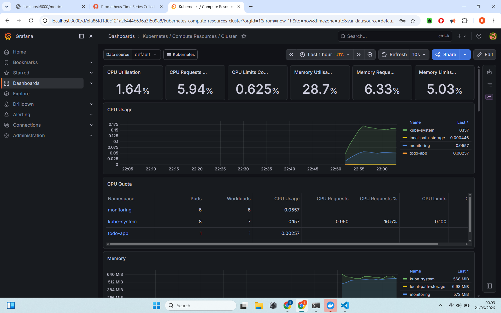
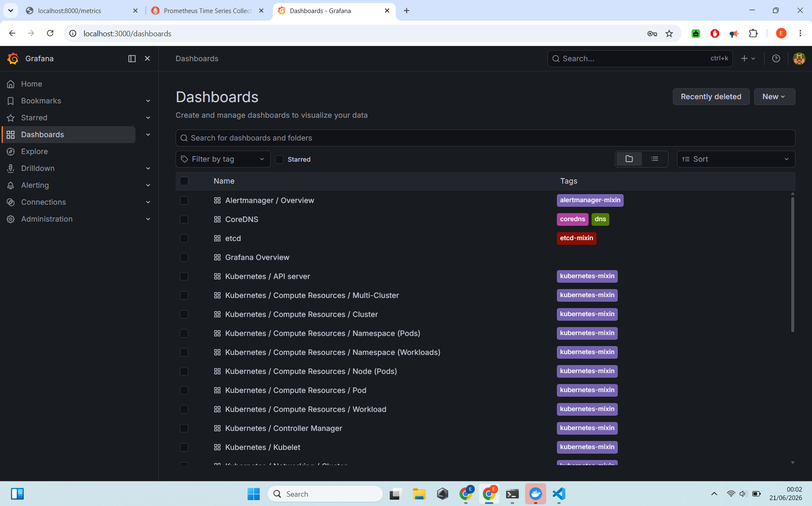
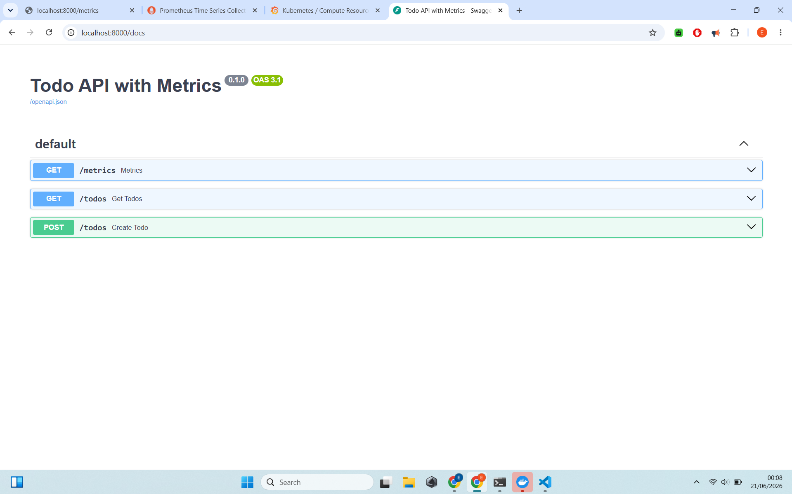
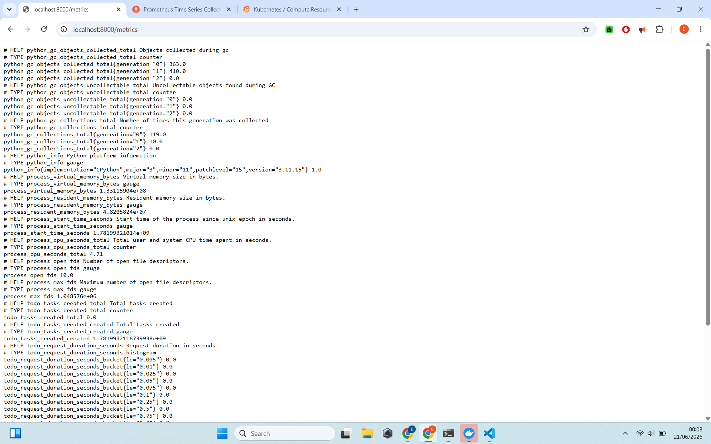
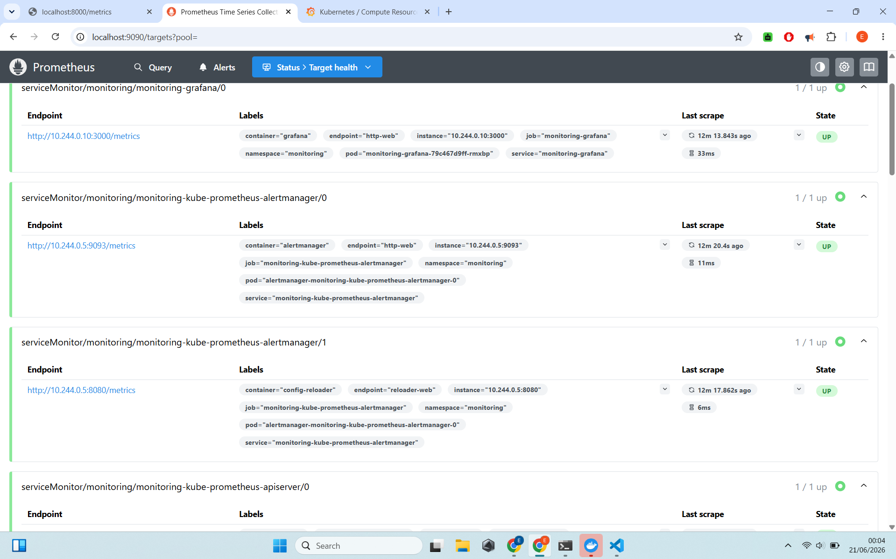
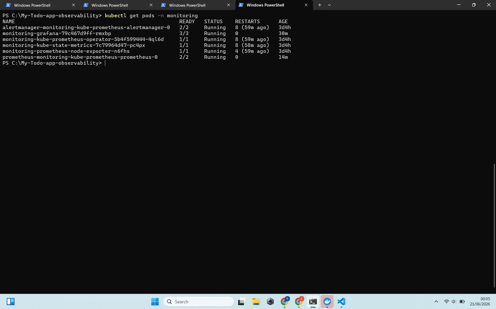
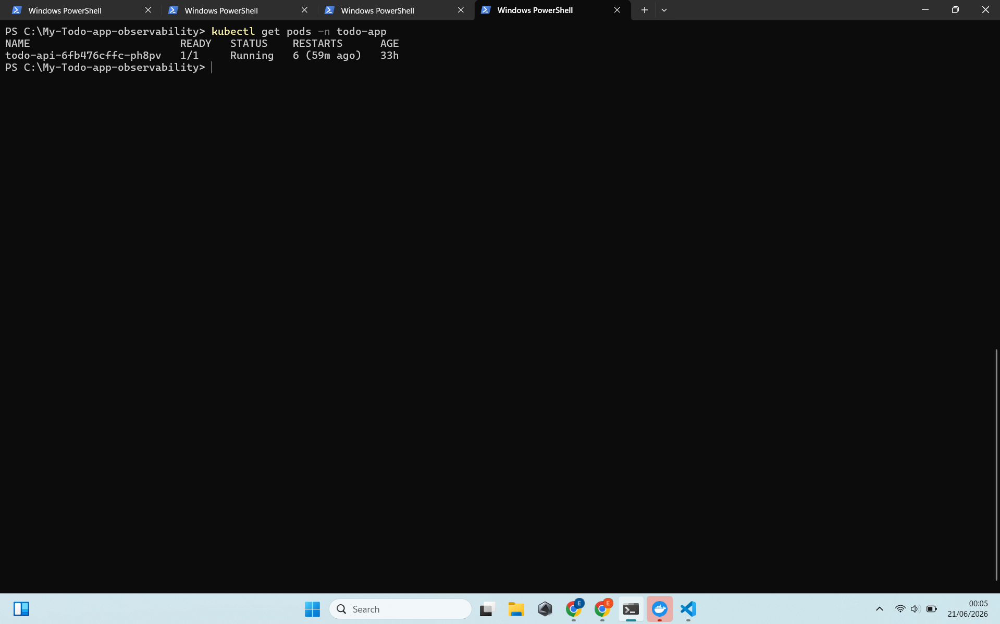

# Prometheus + Grafana Monitoring with Custom Application

**End-to-end observability setup on Kubernetes with a custom instrumented Todo API**

---

## 📋 Project Summary

Set up a full monitoring stack using Prometheus and Grafana on a local Kubernetes cluster (Kind). Deployed a custom Todo API with built-in Prometheus metrics and explored real-time monitoring dashboards.

**Status**: Successfully Implemented

---

## 🎯 Objectives & Achievements

- Deployed Prometheus + Grafana monitoring stack using Helm
- Deployed a custom Todo API with custom Prometheus metrics
- Verified metrics endpoint (`/metrics`)
- Explored pre-built and custom dashboards in Grafana
- Understood the full observability pipeline (collection + visualization)

---

## 🛠️ Technologies Used

| Category              | Technology                              |
|-----------------------|-----------------------------------------|
| Monitoring            | Prometheus                              |
| Visualization         | Grafana                                 |
| Orchestration         | Kubernetes (Kind)                       |
| Package Manager       | Helm                                    |
| Application           | FastAPI (Python)                        |

---

## 📸 Project Screenshots

### 1. Grafana Home Page

### 2. Kubernetes Cluster Overview Dashboard

### 3. Todo API Swagger UI

### 4. Todo API Raw Metrics Endpoint

### 5. Prometheus Targets Page

### 6. Monitoring Namespace Pods

### 7. Todo App Pods

---

## 🧩 Architecture

- Custom Todo API exposes metrics at `/metrics`
- Prometheus scrapes metrics from the application and Kubernetes components
- Grafana visualizes the data in rich dashboards

---

## 💡 Skills Demonstrated

- Setting up production-grade monitoring infrastructure
- Instrumenting applications with Prometheus client library
- Deploying and monitoring custom applications on Kubernetes
- Understanding metrics collection, scraping, and visualization
- Observability best practices for Cloud/DevOps roles

---

## 🚀 How to Reproduce

1. Set up Kind Kubernetes cluster
2. Install Prometheus + Grafana stack using Helm
3. Deploy custom Todo API with metrics endpoint
4. Access Grafana at `http://localhost:3000`

---

**Built locally with ❤️**  
**Completed**: June 2026
